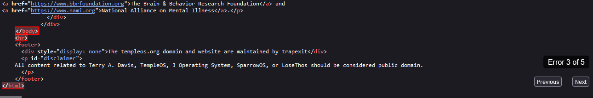

# Source View Tool

I can make error finding in **Mozilla Firefox** more comfortable :)\
I help you jumping right to the errors you need to fix!

## How to use me?

### Bookmarklet

Go to [this website](https://aquajo.github.io/sourceViewTool/) and drag the bookmarklet into your bookmarklets-list.
It should be kept up to date automatically bc of eval!

### The long way

Copy [this](./inject.js) into a console on a Source-View-Page (Ctrl+U) in firefox and jump right into the errors instead of the need to search for them! ^^\
Currently only button-control is supported.

### Other way

You may also find a way to save a browser snippet in Mozilla, similar to how it's done in Chrome.

## Preview

## Todo

- configure auto injection =]
